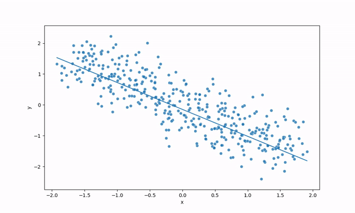

# PaDPaF

Official repo for the paper
["*PaDPaF: Partial Disentanglement with Partially-Federated GANs*"](https://openreview.net/forum?id=vsez76EAV8) (Published in TMLR 2024).
<!-- [arxiv:2212.03836](https://arxiv.org/abs/2212.03836). -->

For federated learning problems, we introduce a personalized generative model that shows the benefits of having local adaptors, such as a local style generator. In the image below, the local adaptor for this regression task is simply chosen to be an additive bias term.

|  |  |
|-|-|
|  |  |

## Running Experiments
Install the requirements:
```
pip install -r requirements. txt
```
The main code is in `run_gan.py`:
```
cd fl_sim
python run_gan.py <args>
```
If on SLURM cluster, you can submit a job:
```
sbatch job-<task>.sh
```
Otherwise, just run the command in the job script directly.

## Notebooks
Notebooks are mainly for smaller experiments and visualization. You have to have a pre-trained model to run them.
